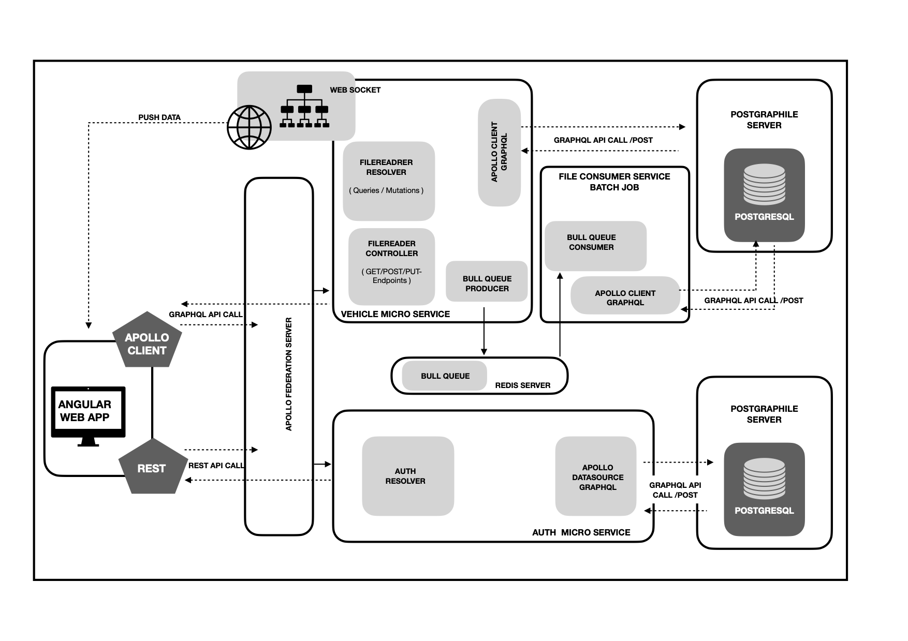

<h3 align="center">:rotating_light: :construction:&ensp;&ensp;Work In Progress&ensp;&ensp;:construction: :rotating_light:</h3>
<h1 align="center">Vehicle Web App Backend</h1>

> CodeLAb assignment-01 code base that belongs to my office work. This is NodeJS web application based on NestJS framework. &ensp;:boat: :boat:

<h2>Content&ensp;&ensp;:book: :book:</h2>

<ul>
    <li>JWT Authentication Server</li>
  
      URL : http://loacalhost:9090/*
      
   <li>CSV File Upload & CRUD Server</li>
   
      URL : http://loacalhost:3000/*
      
  <li>File Consumer Server</li>
    
      URL : http://loacalhost:3001/* 
      
  <li>Vehicle Postgraphile Server</li>
   
      URL : http://loacalhost:5000/*
      
     - if you install Postgraphile globle use this command in your terminal
     - postgraphile -c "postgres:///<TABLE_NAME>" -s <SCHEMA_NAME> --watch
      
</ul>

> Implemented Server

| **Server**                   | **status**        |
|---------------------------|----------------|     
| [VehicleCsvReader-Server](https://github.com/sriThariduSangeeth/Vehicle-Nest-NodeJS-Backend/tree/master/vehicle-csv-reader) | <ul><li>- [x] Implemet</li> |
| [Postgraphile-Server](https://github.com/sriThariduSangeeth/Vehicle-Nest-NodeJS-Backend/tree/master/postgraphile-server)       | <ul><li>- [x] Implemet</li> |
| vehicleForAuth-Server     | <ul><li>- [ ] Implemet</li></ul> |
| [FileConsumer-Server](https://github.com/sriThariduSangeeth/Vehicle-Nest-NodeJS-Backend/tree/master/file-consume-server) | <ul><li>- [x] Implemet</li></ul> |

    
    
    
    
    
    

> Licenses this source under the <u>MIT License</u>,You may not use this file except in compliance with the License.
<!-- Badges -->

  

<h4 align="center">Here is a screenshot of the Architecture Design</h4>
<!-- image -->

